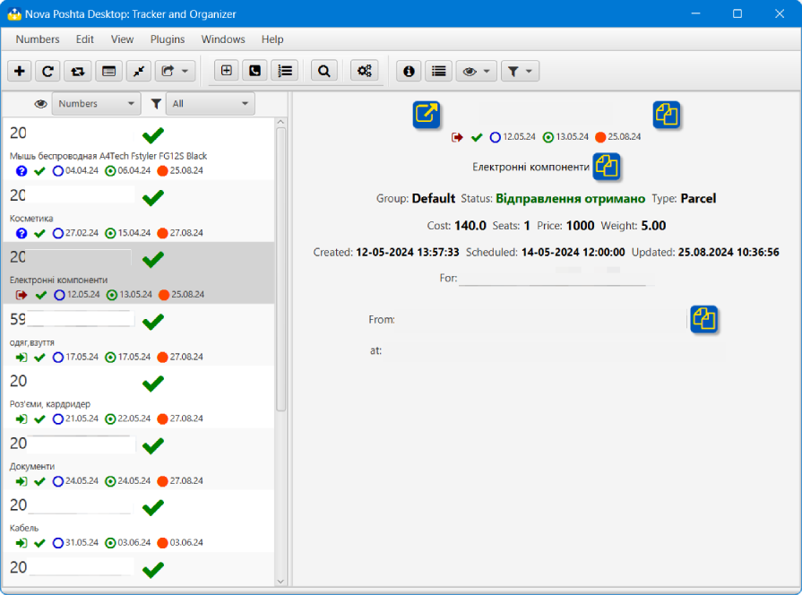

## Nova Poshta: Tracker and Organizer
### _Desktop application to track, organize and manage parcels from Ukrainian delivery operator Nova Poshta_

  

### 💡 Purpose

There wasn't desktop application for Nova Poshta.
That it.
### 📃 Features
- multiple OS
- useful, informative and flexible interface
- in-fly interface language changing
- plugins support
- auto update uncompleted numbers
- some number views and filtration options
- custom numbers list - not all numbers to view, but numbers you need
- numbers grouping support
- extended search with saving search options feature
- multiple addition windows support
- archiving completed/unused numbers
- visually logging main application's events
### ⏬ Getting
You can download archive from [Releases section](https://github.com/anrydas/NovaPoshta/releases) or clone the repository.
Find full application's documentation at: [Ukrainian](help/uk/help.md) and [English](help/en/help.md).
### 🚀 Launch<a id='Launch'/>
The application's distribution included run.cmd or run.sh depended on your OS. Just launch it.
Note: run.* script need to `JAVA_HOME` environment variable. If it doesn't provided made changes into script to include full path to JRE.
### 📜 Main Window<a id='MainWin'/>

###### _Made by -=:dAs:=-_