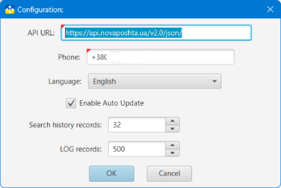

## Nova Poshta: Tracker and Organizer

### Налаштування додатка

In the application configuration window, you can change the following parameters:
- Link to API New Mail. It does not require change. When you enter the wrong link, the app will not be able to receive data from the NP server
- Default Phone number. This number will be sent in request to the NP server to receive a Number's data. Without the Phone number the Number's data received from the server will be incomplete. Therefore, this parameter must be specified.
- Enable or turn off automatic Number's update with "unfinished" status
- Records number in [search history](search.md?history)

Positions and sizes of windows (for those that can change the size) are stored automatically when the window is closed and played when it is shown.
Automatically stored parameters for the following windows:
- [Main window](main.md)
- [Search window](search.md)
- [Detailed view window]()
- [Archived Numbers window](windows.md?archive)
- [Custom view Numbers window](windows.md?custom)
- [Phones edit window](phones.md)
- [Groups edit window](groups.md)
- [Search options edit window](search.md?options)

#### [to Contents](help.md)

###### _Made by -=:dAs:=-_