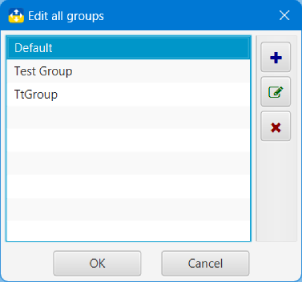

## Nova Poshta: Tracker and Organizer

### Групи
All Numbers in the application can be divided into groups. After the first start, one group **Default** is created, in which creates all new Numbers.

You can add a new group using [Menu](menu.md?menu) **Edit**, or using a button on the [Toolbar](menu.md?toolbar)
Also add, change and delete groups you can in [Group edit window](#edit)

There can be no two different groups with the same name.
#### Вікно редагування груп<a id='edit'/>

In the group editing window, you can add, change and delete groups. The changed data is highlighted in the list of bold.

All actions are performed with the appropriate buttons. All changes are fixed only after pressing the button **OK**

It is impossible to remove the non-empty group. To removing the non-empty group move numbers from it another group (or to erchive), and only then - remove the group.

#### [to Contents](help.md)

###### _Made by -=:dAs:=-_