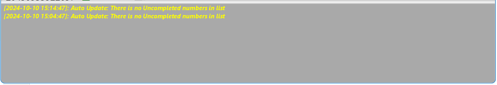

## Nova Poshta: Tracker and Organizer

### Log

After pressing the **Toggle Log** button on the [Toolbar](menu.md?toolbar) or selection of the appropriate menu item in the menu **View**, in the bottom of the [Main window](main.md) the log area will be displayed showing the main actions of the application.

New records in the log area are added to the top line. Upon reaching the maximum number of entries, older entries will be deleted from the log.

The Log has a context menu that allows you to copy the log records to the clipboard or clear the Log.

The maximum number of log records is set in [config window](config.md).

#### [to Contents](help.md)

###### _Made by -=:dAs:=-_