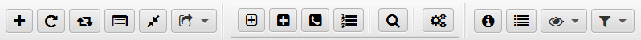

## Nova Poshta: Tracker and Organizer

### Menu and Toolbar
#### Toolbar<a id='toolbar'/>

_All panel buttons have the same images as the corresponding [menu items](#menu), so they are easy to identify._

The Toolbar contains the following application commands:
- [Add Number](new.md) - add new number
- Update Number - update selected Number
- Update uncompleted - update all Numbers having Uncompleted status
- [Add to Custom view](windows.md?custom) - Add Number to Custom view
- [Move to Archive](windows.md?archive) - move number to Archive
- [Add new group](groups.md) - adding new group
- [Edit Groups](groups.md?edit) - edit groups window
- [Edit Phones](phones.md) - edit phones window
- [Edit Search Options](search.md?options) - edit search options window
- [Search](search.md?search) - Search window
- [Configuration](config.md) - configuration window
- [Detailed info](detail.md) - detailed Number info window
- [Toggle Log](log.md) - show or hide the Log
- [View mode](view_mode.md?view) - select the view mode
- [Filtering mode](view_mode.md?filter) - select the filtering mode
#### Menu<a id='menu'/>
The menu contains all application commands:
**Numbers**
  - [Add Number](new.md) - add new number
  - Update Number - update selected Number
  - Update uncompleted - update all Numbers having Uncompleted status
  - [Add to Custom view](windows.md?custom) - Add Number to Custom view
  - [Move to Archive](windows.md?archive) - move number to Archive
  - Exit - exit application
**Edit**
  - [Add new group](groups.md) - adding new group
  - [Edit Groups](groups.md?edit) - edit groups window
  - [Edit Phones](phones.md) - edit phones window
  - [Edit Search Options](search.md?options) - edit search options window
  - [Search](search.md?search) - Search window
  - [Configuration](config.md) - configuration window
**View**
  - [View mode](view_mode.md?view) - select the view mode
  - [Filtering mode](view_mode.md?filter) - select the filtering mode
  - [Detailed info](detail.md) - detailed Number info window
  - [Toggle Log](log.md) - show or hide the Log
**Plugins**
  - Load plugins - reload [plugins](plugins.md) from storage
  - _<plugins menu items>_ - send data to plugin
**Windows**
  - [Custom view numbers](windows.md?custom) - Custom view window
  - [Archived numbers](windows.md?archive) - Archived numbers window
  - Cascade - show all additional windows as cascade
  - Close all - close all additional windows
**Help**
  - About - information about application version
    
_All menu items have the same images as the corresponding buttons of [Toolbar](#toolbar), so they are easy to identify._

#### [to Contents](help.md)

###### _Made by -=:dAs:=-_