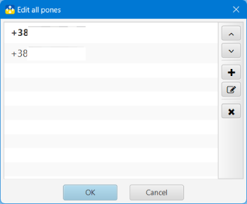

## Nova Poshta: Tracker and Organizer

### Phone numbers

In the application, several phone numbers can be stored, which are used to receive data about Number from the NP server. For example, it can be your personal phone number and the Business phone number for order tracking.

You can add, change and delete phone numbers in the phone number editing window. The main phone number in the list will be highlighted in bold.

All actions are performed using the corresponding buttons. All changes are fixed only after pressing the **OK** button

The phone number used in Number(s) cannot be deleted. To delete a phone number, you must first transfer associated Numbers to the archive.

#### [to Contents](help.md)

###### _Made by -=:dAs:=-_