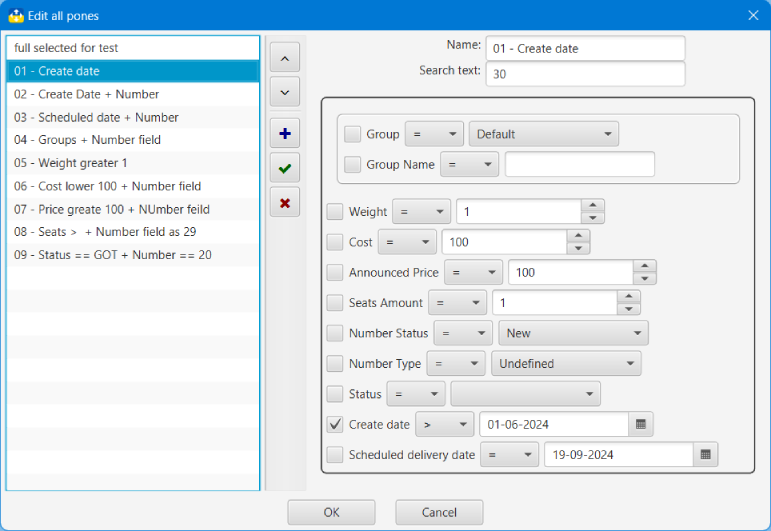

## Nova Poshta: Tracker and Organizer

### Search, Search Options
#### Search<a id='search'/>

Search has 2 modes:
- simple - search the entered text only in the Numbers number; this is the default search. Activated by selecting **Simple Search**
- advanced - search for the entered text in the fields selected by the user according to [Search options](#options). Activated by selecting **Advanced search**

The search can take place in the main list of Numbers, and in [Archived Numbers](windows.md?archive). You can choose a place by choosing **In Archive**

**_Advanced Search_** allows you to set search options, save and restore [Search Options](#options)

You can select the fields in which the search will take place using the **Field list**. By default, search is selected in the **User Comment** and **Description** fields

**_The search is case-insensitive_**

The search window has a menu button [plugins](plugins.md), with which you can transfer all or only selected TTNs in the search results to the plugin. If the **All items** option is activated, all search results will be transferred, otherwise - only the selected ones.

#### Search history<a id='history'/>
The application keeps a history of search queries that have been entered in the search text line and suggests it, if there are matches, when entering a new search query. The number of search history entries can be changed in [Settings window](config.md) in the range from 10 to 500 entries. When the maximum number of records is reached, older records will be deleted.

History records are unique, meaning no two records can have the same text.
#### Search options<a id='options'/>

The search options contain the following information:
- search name
- the text to be searched for
- fields in which the search will take place
- search by group:
- group: matches or does not match
- group name: matches, does not match or contains text
- weight: equal, not equal, more, less
- value: equal, not equal, more, less
- declared value: equal, not equal, greater than, less than
- seats amount: equal, not equal, more, less
- Number state: equal, not equal to one of the states: new, delivered, error, waiting, completed
- Number type: equal, not equal to one of the types: inbound, outbound, undefined
- Number status: equal, not equal to one of the NP's Number statuses
- date of creation of Number: equal, not equal, greater than, less than the value of the date
- the date of the scheduled delivery of the TTN: equal, not equal, greater than, less than the value of the date

In the edit search parameters window, you can add, change and delete search parameters. Changed data is highlighted in bold in the list.

All actions are performed using the corresponding buttons. All changes are fixed only after pressing the **OK** button

#### [to Contents](help.md)

###### _Made by -=:dAs:=-_