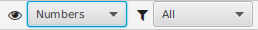

## Nova Poshta: Tracker and Organizer

### View modes, Filtration

The application allows you to change the viewing and filtering mode for more convenient work. This can be done using:
- [Menu](menu.md?menu) - "View" select the viewing or filtering mode
- [Toolbar](menu.md?toolbar) - select viewing or filtering mode
- corresponding lists in the left part of [Main window](main.md) 
#### View mode<a id='view'/>
The application has the following viewing modes:
- Numbers list
- Numbers by Groups
- Numbers by date of creation
- TNumbers by the date of update

When changing the viewing mode, the list of Numbers will change accordingly. The [List items](main.md?element) view remain unchanged. It will also remain unchanged the [Context menu](main.md?context) of the list element.

#### Filtering mode<a id='filter'/>
The application has the following filtering modes (by Number type):
- All
- Inbound
- Outbound
- Undefined

When you change the filtering, the list of Numbers will change accordingly to show only those Numbers that satisfy the selected filter.

#### [to Contents](help.md)

###### _Made by -=:dAs:=-_