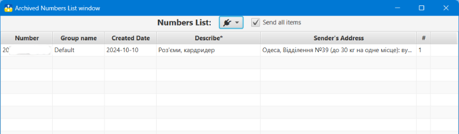
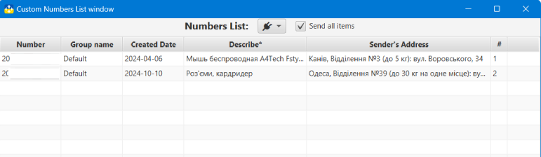

## Nova Poshta: Tracker and Organizer

### Archive Numbers and Custom Numbers view
### Archive Numbers<a id='archive'/>

You can show this window using the [Menu](menu.md?menu) item **Windows -> Archive numbers**

Numbers may be moved to the archive. You can move using [Context menu](main.md?context), [Menu](menu.md?menu) or [Toolbar](menu.md?toolbar)

From the list, archived Numbers can be moved to [Plugin](plugins.md). If the **All items** option is activated, all search results will be transferred, otherwise - only the selected ones.

The list has a context menu that allows you to restore or permanently delete the item(s).

**_You can finally delete TTN only from the archive._**

### Custom Numbers view<a id='custom'/>

You can show this window using [Menu](menu.md?menu) **Windows -> Selected numbers**

Any Number from the list in [Main window](main.md) can be added to the Custom Numbers view using [Context menu](main.md?context), [Menu](menu.md?menu) or [Toolbar](menu.md?toolbar)

From the list of Custom Numbers view, you can go to the main window using **Ctr + Click** on the element.
Double-clicking on the element will open [Detailed view window](detail.md)

The list has a context menu that allows you to delete items or clear the list completely. **_Items are only removed from the favorites list_**

The Custom Numbers view window has a menu button [plugins](plugins.md) with which you can move all or only selected TTNs in the search results to the plugin. If the **All items** option is activated, all search results will be transferred, otherwise - only the selected ones.

The list of Custom Numbers view is saved and will be available after restarting the application.

#### [to Contents](help.md)

###### _Made by -=:dAs:=-_