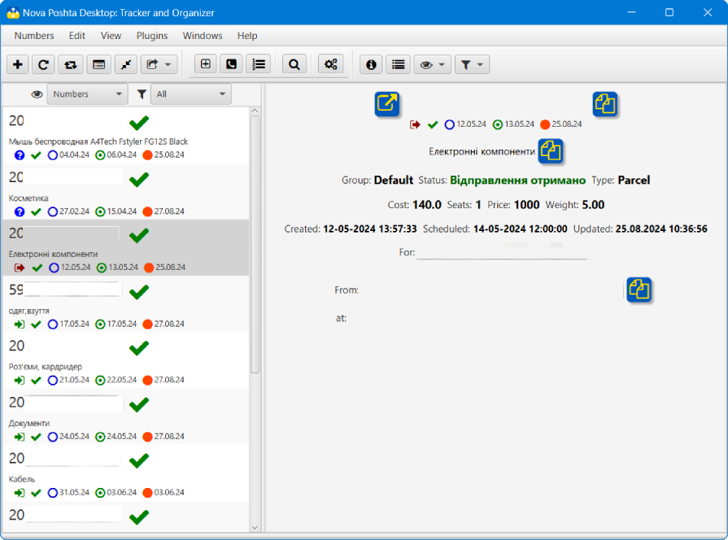

## Нова пошта: трекер та органайзер

### Головне вікно

В головному вікні додатку показано всі додані на цей час ТТН (ліворуч), [детальне інфо про номер](#detail) (праворуч). Також в нижній частині вікна є [Журнал](log.md), де показано основні події додатка.
#### Елемент списку<a id='element'/>

Елемент списку містить основну інформацію про ТТН:
- номер ТТН
- статус номеру (новий, помилка, в обробці, очикує, завершено)
- опис або коментар користувача (якщо додано); якщо вказано і опис, і коментар користувача, то буде показано коментар - пріоритет користувацьких правок
- тип номеру (вхідний, вихідний, невизначено)
- статус номеру (зменшений), дата створення, дата додавання в додаток, дата останнього оновлення
#### Детальний перегляд<a id='detail'/>

В детальному перегляді видно всі основні поля ТТН. Детальний перегляд майже повністю дублює (окрім збільшеного статусу ТТН) [Едемент списку](#element)
Також тут є кнопки, що дозволяють скопіювати текст до системного буфера обміну, а також кнопка відкривання [Вікна детального перегляду ТТН](detail.md), де показано всі дані ТТН.
#### Контекстне меню<a id='context'/>

В контекстному меню [Елемента списку](#element) містяться основні команди ТТН
Також ці команди є в [Меню](menu.md?menu) та в [Панельі інструментів](menu.md?toolbar).

#### [до Змісту](help.md)

###### _Made by -=:dAs:=-_