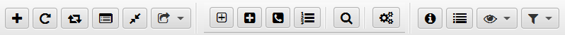

## Нова пошта: трекер та органайзер

### Меню та панель інструментів
#### Панель інструментів<a id='toolbar'/>

_Усі кнопки панелі мають такі ж зображення, що й відповідні [пункти меню](#menu), тому їх легко ідентифікувати._

В панелі інструментів містяться такі команди додатку:
- [додати новий ТТН](new.md) - додати новий ТТН
- оновити активний ТТН - оновити вибраний ТТН
- оновити всі незавершені ТТН - оновити все ТТН в додатку, у яких статус "Не завершено"
- [додати ТТН до обраних](windows.md?custom) - додати ТТН до списку обраних
- [перемістити ТТН до архіву](windows.md?archive) - перемістити ТТН до архіву
- [додати нову групу](groups.md) - додати нову групу
- [редагувати групи](groups.md?edit) - вікно редагування груп
- [редагувати номери телефонів](phones.md) - вікно редагування номерів
- [редагувати налаштування пошуку](search.md?options) - вікно редагування налаштувань пошуку
- [пошук](search.md?search) - вікно пошуку
- [налаштування додатку](config.md) - вікно налаштувань
- [детальний перегляд ТТН](detail.md) - вікно детально перегляду ТТН
- [показати журнал](log.md) - вікно журналу
- [вибрати режим перегляду](view_mode.md?view) - змінити режим перегляду ТТН
- [вибрати режим фільтрації](view_mode.md?filter) - змінити режим фільтрації ТТН
#### Меню<a id='menu'/>
Меню містить усі команди додатку:
**Номер**
  - [додати новий ТТН](new.md)
  - оновити активний ТТН
  - оновити всі незавершені ТТН
  - [додати ТТН до обраних](windows.md?custom) - додати ТТН до списку обраних
  - [перемістити ТТН до архіву](windows.md?archive) - перемістити ТТН до архіву
  - вихід з додатка - завершення роботи з додатком
**Змінити**
  - [додати нову групу](groups.md) - додати нову групу
  - [редагувати групи](groups.md?edit) - вікно редагування груп
  - [редагувати номери телефонів](phones.md) - вікно редагування номерів
  - [редагувати налаштування пошуку](search.md?options) - вікно редагування налаштувань пошуку
  - [пошук](search.md?search) - вікно пошуку
  - [налаштування додатку](config.md) - вікно налаштувань
**Перегляд**
  - [вибрати режим перегляду](view_mode.md?view) - змінити режим перегляду ТТН
  - [вибрати режим фільтрації](view_mode.md?filter) - змінити режим фільтрації ТТН
  - [детальний перегляд ТТН](detail.md) - вікно детально перегляду ТТН
  - [показати журнал](log.md) - вікно журналу
**Плагіни**
  - завантажити плагіни - перезавантаження даних про [плагіни](plugins.md) зі сховища
  - _<пункти меню плагінів>_ - надіслати дані до плагіну
**Вікна**
  - [обрані номери](windows.md?custom) - показати вікно обраних ТТН
  - [архівні номери](windows.md?archive) - показати вікно архівних ТТН
  - вишикувати вікна каскадом
  - закрити всі додаткові вікна
**Допомога**
  - про додаток - інформація про версію додатка
    
_Усі пункти меню мають такі ж зображення, що й відповідні кнопки [панелі інструментів](#toolbar), тому їх легко ідентифікувати._

#### [до Змісту](help.md)

###### _Made by -=:dAs:=-_