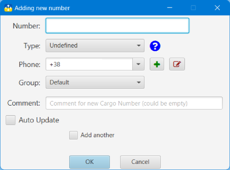

## Нова пошта: трекер та органайзер

### Додавання нового ТТН

У Вікні додавання нового ТТН необхідно вказати:
- тип ТТН (вхідний, вихідний, невизначено)
- номер телефону отримувача чи відправника
- групу
- коментар користувача
- чи потрібно оновлювати ТТН автоматично

Якщо планується додавання ще одного ТТН, то можна вибрати "Додати ще один", тоді вікно після додавання поточногоТТН не буде закрито

Одночасно може бути відкрито кілька вікон додавання нового ТТН. Якщо при завершенні роботи додатка все ще є відкриті вікна додавання, то додаток роботу не завершить, а запропонує закрити вказані вікна або завершити додавання.

#### [до Змісту](help.md)

###### _Made by -=:dAs:=-_