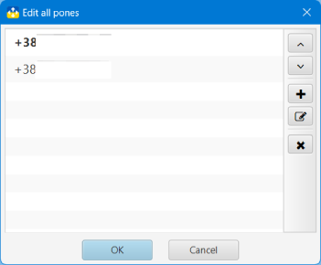

## Нова пошта: трекер та органайзер

### Номери телефонів

В додатку може бути збережено кілька номерів телефонів, які використовуються для отримання даних про ТТН з сервера НП. Наприклад, це може бути Ваш особистий телефон та телефон ФОП для відстеження замовлень.

У вікні редагування номерів телефонів можна додавати, змінювати та видаляти номери телефонів. Основний номер телефону в списку буде виділено жирним шрифтом.

Всі дії виконуються за допомогою відповідних кнопок. Усі зміни закріплюються лише після натискання кнопки **OK**

Номер телефону, що використовується в ТТН, не може бути видалений. Для видалення телефонного номера спершу потрібно перенести прив'язані до нього ТТН до архіву.

#### [до Змісту](help.md)

###### _Made by -=:dAs:=-_