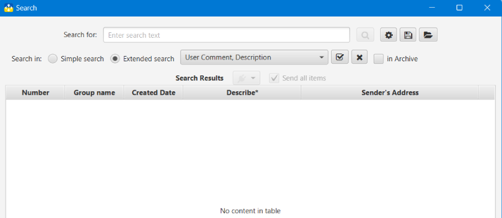
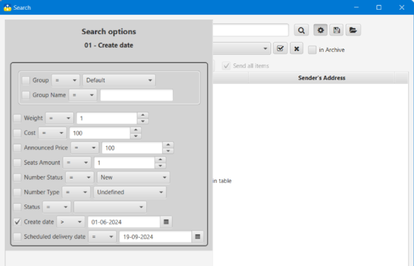
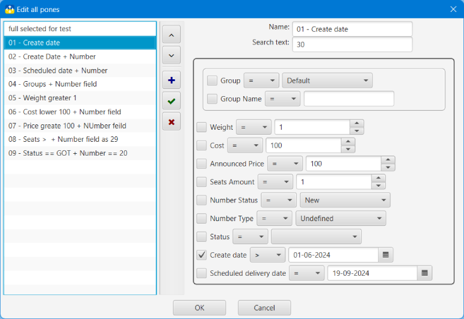

## Нова пошта: трекер та органайзер

### Пошук, Параметри пошуку
#### Пошук<a id='search'/>

Пошук має 2 режими:
- простий - шукати введений текст лише у номері ТТН; це пошук за замовчуванням. Активується вибором **Простий пошук**
- розширений - шукати введений текст в обраних користувачем полях згідно з [Параметрами пошуку](#options). Активується вибором **Розширений пошук**

Пошук може відбуватися в основному списку ТТН, та в [Архіві ТТН](windows.md?archive). Обрати місце можна вибравши **в архіві**

**_Розширений режим_** пошуку дозволяє встановлювати параметри пошуку, зберігати та відновлювати [Параметри пошуку](#options)

Обирати поля, в яких відбуватиметься пошук можна за допомогою **Списку полів**. За замовчуванням вибрано пошук у полях **Користуваций коментар** та **Опис**

**_Пошук відбувається без урахування регістру символів_**

Вікно пошуку має кнопку меню [плагінів](plugins.md), за допомогою якої можна передати всі чи лише виділені ТТН в результатах пошуку до плагіну. При активованому виборі **Передати всі** будуть передані всі результати пошуку, інакше - лише виділені.

#### Історія пошуку<a id='history'/>
Додаток зберігає історію запитів пошуку, що були введені в рядок пошукового тексту, та пропонує, за наявності збігів, під час введення нового пошукового запиту. Кількість записів історії пошуку може бути змінена у [Вікні налаштувань](config.md) в діапазоні від 10 до 500 записів. При досягненні максимальної кількості записів старіші записи видалятимуться.

Записи історії унікальні, тобто не може бути двох записів з однаковим текстом.
#### Параметри пошуку<a id='options'/>

Параметри пошуку містять таку інформацію:
- назва пошуку
- текст, що шукається
- поля, в яких відбуватиметься пошук
- пошук по групі:
  - група: збігається чи не збігається
  - ім'я групи: збігається, не збігається чи містить текст
- вага: дорівнює, не дорівнює, більше, менше
- вартість: дорівнює, не дорівнює, більше, менше
- оголошена вартість: дорівнює, не дорівнює, більше, менше
- кількість місць: дорівнює, не дорівнює, більше, менше
- стан ТТН: дорівнює, не дорівнює одному зі станів: новий, доставляється, помилка, очікує, завершено
- тип ТТН: дорівнює, не дорівнює одному із типів: вхідний, вихідний, невизначено
- статус ТТН: дорівнює, не дорівнює одному зі статусів ТТН НП
- дата створення ТТН: дорівнює, не дорівнює, більше, менше значенню дати
- дата запланованого доставлення ТТН: дорівнює, не дорівнює, більше, менше значенню дати

У вікні редагування параметрів пошуку можна додати, змінити та видалити параметри пошуку. Змінені дані виділяються у списку жирним шрифтом.

Всі дії виконуються за допомогою відповідних кнопок. Усі зміни закріплюються лише після натискання кнопки **OK**

#### [до Змісту](help.md)

###### _Made by -=:dAs:=-_